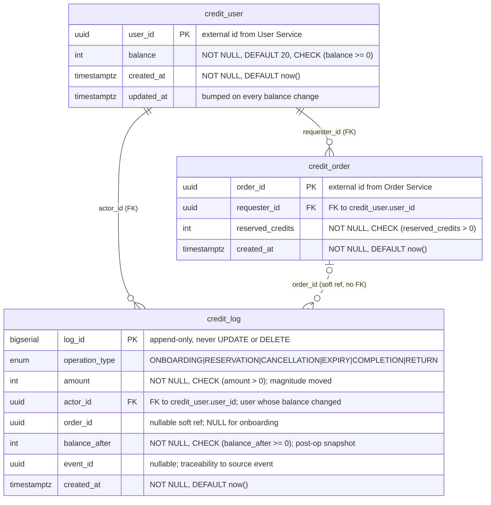

# Credit Service — Database Schema

**Datastore:** PostgreSQL · **Model:** balance + active-reservation + append-only audit log

The Credit Service tracks a closed credit economy for Friend on Campus (FoC).
Credits never convert to money; they only circulate between users. This document
describes the persistence model backing requirements F1–F5.

## Design decisions

- **PostgreSQL** — ACID transactions and `CHECK` constraints enforce the money
  invariants (balance ≥ 0, reserved > 0) atomically (F1.1.1, F1.2.1, F3.3.3, F4.2, F4.3, F5.2).
- **Credits are whole integers.** The onboarding grant is `20`. Switch to
  `NUMERIC` only if fractional credits are ever required.
- **`user_id` / `order_id` are external `UUID`s** minted by User Service and
  Order Service respectively. This service never generates them. Swap to
  `VARCHAR` if those services use non-UUID identifiers.
- **`credit_log` is append-only** — never `UPDATE`d or `DELETE`d. A row is
  written for every state-changing transaction (F1.3.2).
- **Reservations are hard-deleted** on completion / cancellation / expiry /
  return (F4.2.2, F4.3.2, F5.2.2). `credit_order` therefore holds only
  *currently active* reservations. Because orders are deleted,
  `credit_log.order_id` is a plain reference column, **not** a foreign key — the
  log must outlive the order.
- **Idempotency is structural, not a separate table.** The event flows are
  naturally idempotent because their effect is a unique row transition:
  - **Onboarding (F2)** is *create-once*. A redelivered event finds the user
    already present and is discarded (F2.2.1). The `credit_user.user_id` primary
    key enforces this even under a concurrent double-delivery.
  - **Order events (F4)** are *delete-once*. A redelivered event finds the order
    already gone and is discarded (F4.1.2). The `credit_order.order_id` primary
    key plus the delete enforce this.

  To preserve the guarantee, **do not read-then-write**. Instead:
  - Onboarding → `INSERT ... ON CONFLICT (user_id) DO NOTHING`.
  - Complete / cancel / return → `DELETE FROM credit_order WHERE order_id = ?
    RETURNING requester_id, reserved_credits`, and apply the balance change
    **only if a row was returned**. Duplicate deliveries delete 0 rows → no-op;
    a stray completed-vs-cancelled collision resolves to whoever deletes first.

## Entity–Relationship Diagram

**Reading the diagram**

- **Solid lines** are enforced foreign keys. A `credit_user` has 0..N
  reservations and 0..N log entries; each `credit_order` / `credit_log` points to
  exactly one user.
- The **dashed line** (`credit_order ⇠ credit_log`) is the intentional *soft*
  link on `order_id`. No FK, because orders are hard-deleted while their log rows
  survive — a log row references 0..1 order (0 for onboarding, or once the order
  is gone).

## Tables

### `credit_user` — one balance row per user

Tracks the current available credit balance per user (F1.1). Requesters and
couriers are the same entity here; roles live in User Service.

| Column | Type | Constraints | Notes |
|---|---|---|---|
| `user_id` | `UUID` | **PK** | External id from User Service (F2). |
| `balance` | `INTEGER` | `NOT NULL`, `DEFAULT 20`, `CHECK (balance >= 0)` | Balance floor (F1.1.1); default onboarding grant (F2.2.2). |
| `created_at` | `TIMESTAMPTZ` | `NOT NULL DEFAULT now()` | |
| `updated_at` | `TIMESTAMPTZ` | `NOT NULL DEFAULT now()` | Bump on every balance change. |

### `credit_order` — active reservations only

Tracks credits currently locked in an open order (F1.2). Rows are hard-deleted
once the order is completed, cancelled, expired, or returned.

| Column | Type | Constraints | Notes |
|---|---|---|---|
| `order_id` | `UUID` | **PK** | External id from Order Service; PK gives F3 reserve idempotency. |
| `requester_id` | `UUID` | `NOT NULL`, **FK → `credit_user(user_id)`** | Who to refund on cancel/return (F4.2.1, F5.2.1). |
| `reserved_credits` | `INTEGER` | `NOT NULL`, `CHECK (reserved_credits > 0)` | F1.2.1, F3.1.1. |
| `created_at` | `TIMESTAMPTZ` | `NOT NULL DEFAULT now()` | |

No `courier_id` column: the courier is only known at completion and is captured
in `credit_log.actor_id`.

### `credit_log` — append-only audit of every operation (F1.3)

One row per state-changing transaction (F1.3.2).

| Column | Type | Constraints | Notes |
|---|---|---|---|
| `log_id` | `BIGSERIAL` | **PK** | |
| `operation_type` | `credit_operation` (enum) | `NOT NULL` | See enum below (F1.3.1). |
| `amount` | `INTEGER` | `NOT NULL`, `CHECK (amount > 0)` | Magnitude of credits moved (F1.3.1). |
| `actor_id` | `UUID` | `NOT NULL`, **FK → `credit_user(user_id)`** | The user whose balance changed (F1.3.1). |
| `order_id` | `UUID` | `NULL` | Soft reference; `NULL` for onboarding. Not a FK — orders get deleted. |
| `balance_after` | `INTEGER` | `NOT NULL`, `CHECK (balance_after >= 0)` | Actor's balance snapshot after this op, for reconciliation. |
| `event_id` | `UUID` | `NULL` | Traceability to the source event; `NULL` for HTTP-initiated F3/F5. |
| `created_at` | `TIMESTAMPTZ` | `NOT NULL DEFAULT now()` | |

**`operation_type` enum** — `ONBOARDING`, `RESERVATION`, `CANCELLATION`,
`EXPIRY`, `COMPLETION`, `RETURN`. The requester-side ops
(`CANCELLATION` / `EXPIRY` / `RETURN`) credit the requester; `COMPLETION` credits
the courier. F1.3.1's list is illustrative — collapse to a single
`CANCELLATION` value if per-cause reporting is not needed.

## Transaction boundaries

Each flow runs as a single database transaction so that partial failure rolls
back (F3.3.3, F4.2, F4.3, F5.2).

| Flow | Requirement | The transaction does |
|---|---|---|
| Onboarding (event) | F2.2.2 | `INSERT credit_user (balance = 20) ON CONFLICT DO NOTHING` → if inserted: `INSERT credit_log (ONBOARDING)`. |
| Reserve (HTTP, order create) | F3.3 | `UPDATE credit_user SET balance = balance - n` (row `CHECK` guards F3.2.1) + `INSERT credit_order` + `INSERT credit_log (RESERVATION)`. |
| Complete (event) | F4.3 | `DELETE credit_order RETURNING ...` (validates existence, F4.1.2) + `UPDATE credit_user SET balance = balance + n` for courier + `INSERT credit_log (COMPLETION)`. |
| Cancel / expire (event) | F4.2 | `DELETE credit_order RETURNING ...` + `UPDATE credit_user SET balance = balance + n` for requester + `INSERT credit_log (CANCELLATION\|EXPIRY)`. |
| Return (HTTP endpoint) | F5.2 | `DELETE credit_order RETURNING ...` (F5.1.1) + `UPDATE credit_user SET balance = balance + n` for requester + `INSERT credit_log (RETURN)`. |
